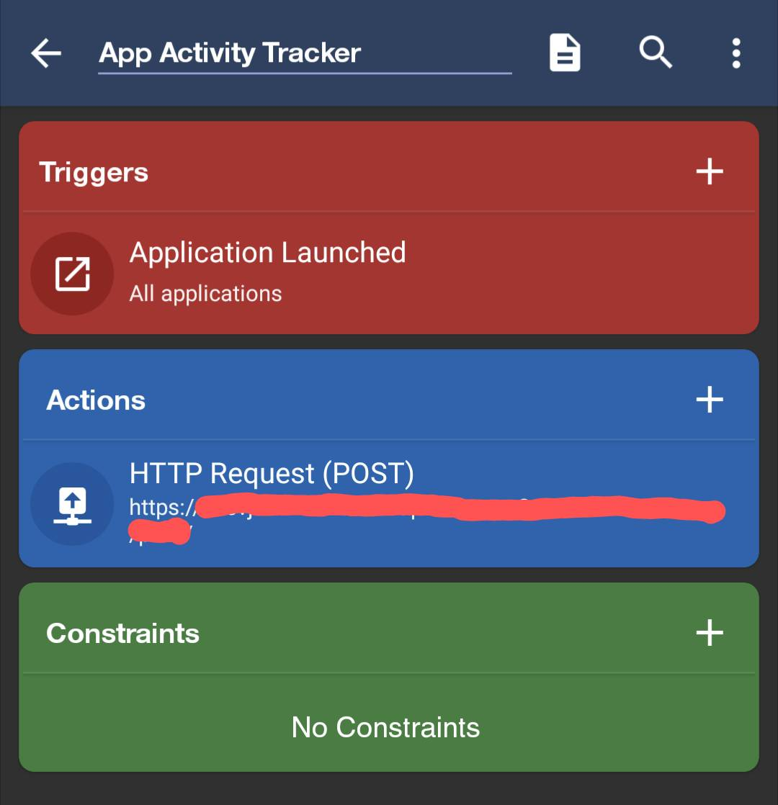
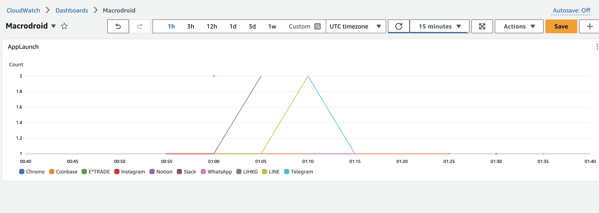

# macrodroid-aws-monitoring
This project visualise your phone usage patterns by integrating [MacroDroid](https://www.macrodroid.com/), an automation app in Android, and AWS monitoring system using macros. The project aims at,
- visualising patterns
- identifying distractions
- automating alarms
- answering question such as,
    - Which apps were opened frequently?
    - Which apps were sending the most notifications?
    - How much time were spent on a specific app?

Macros can be setup with [MacroDroid](https://www.macrodroid.com/) on Android, defining HTTP request endpoint and send data to AWS APIs which are architected with "Infrastruct as Code" framework [AWS Cloud Development Kit](https://aws.amazon.com/cdk/)(AWS CDK).

#### MacroDroid setup

#### AWS Monitoring
